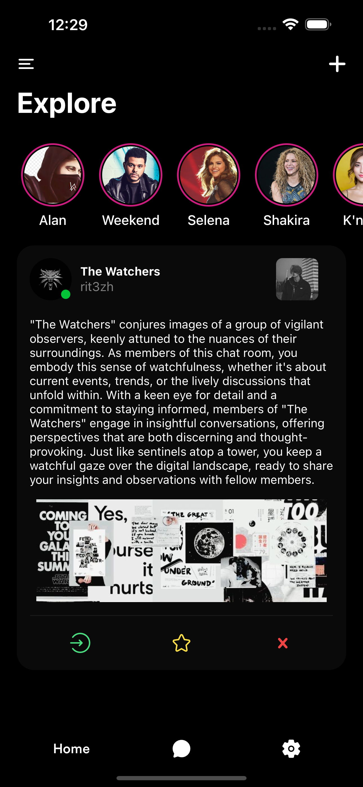
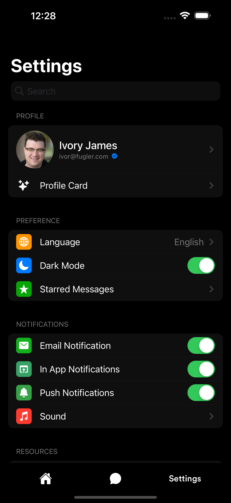
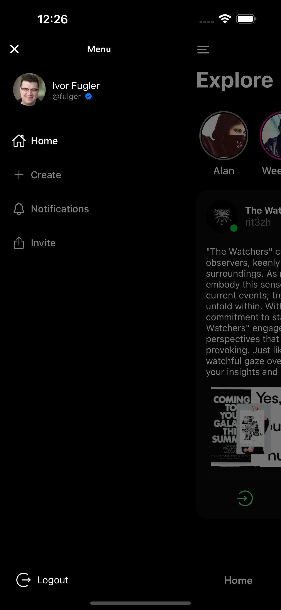

    
    

    
        <h1 align="center">Echo
        <h2 align="center">The most complete Chat UI App ❤️

 

  

      
  

  
  
  
  

# Features 🚀

- Enjoy a visually pleasing and intuitive user interface that follows iOS design principles, providing a seamless chatting experience.

- Easily view and manage your contacts through the user list feature, facilitating effortless communication with friends and family.

- Customize your Echo experience with the settings screen, allowing you to personalize various aspects of the app to suit your preferences.

- Stay connected with your contacts through engaging and immersive stories, reminiscent of the popular feature found in Instagram.

- Access various sections of the app conveniently with the side drawer navigation, providing quick and easy navigation throughout Echo.

- Utilize the iOS form sheet navigation style for modal views, ensuring a consistent and familiar experience for iOS users.

- Navigate seamlessly through different levels of the app with nested navigation, allowing for intuitive exploration and interaction.

- Echo offers a plethora of additional features to enhance your chatting experience.

> [!NOTE]  
> Make sure to check out the attached ScreenShots.

# ScreenShots 📷

| | | |
|:-------------------------:|:-------------------------:|:-------------------------:|
| | ||
|  |  ||
|  |  ||

# Installation ❓

To install Echo, follow these steps:

1. Clone the repository: `git clone https://github.com/rit3zh/echo`
2. Navigate to the project directory: `cd echo`
3. Open XCode inside of your `ios` then inside "Echo" paste your `GoogleService-info.plist file`
4. Install dependencies: `npm install`
5. Run the application: `npm run ios`

> [!WARNING]  
> Don't forgot to add `GoogleService-info.plist file` inside of your `ios/Echo` folde.

### ⭐ Leave a Star if you like this repostitory ⭐
